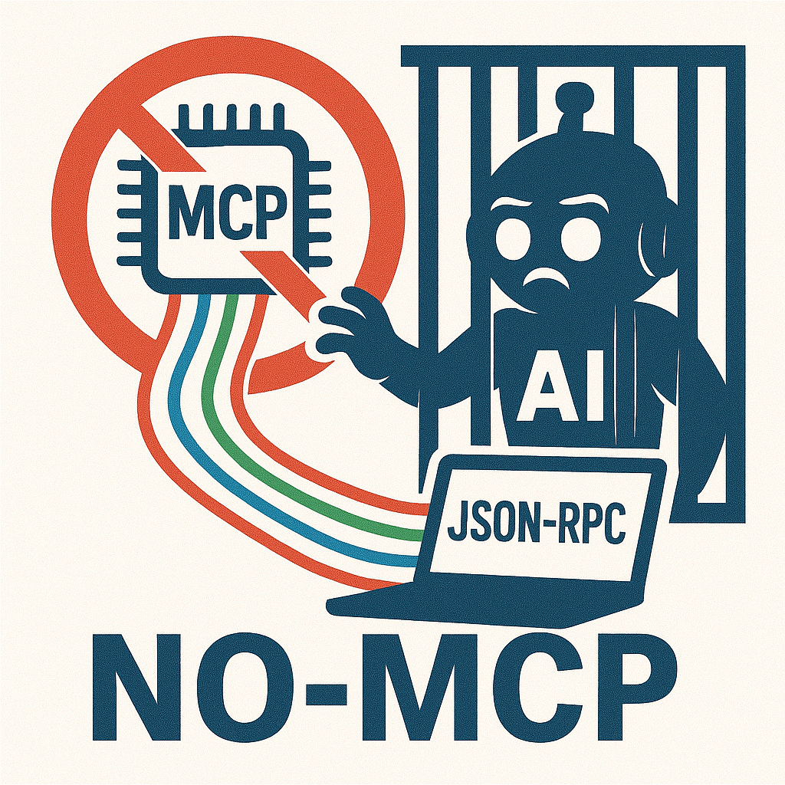

<!-- Logo -->
<p align="center">
  
</p>

<p align="center">
  Leverage Model Context Protocol Servers (MCP) JSON RPC definitions for scripting purposes.
</p>

<p align="center">
  
  
  
</p>

---

## 🧾 About

**NO-MCP** "no model context"-protocol, is a non-agentic Python client designed to interact directly with MCP (Modular Command Platform) JSON-RPC tools. It enables scripts to invoke toolcalls manually without the need for agent-based orchestration.

## Features

- **Direct Tool Invocation** – Call MCP JSON-RPC tools directly from your scripts.
- **Non-Agentic Design** – Bypasses the need for agent frameworks, offering greater control and simplicity.
- **Lightweight Implementation** – Minimal dependencies for easy integration.

## Installation

Clone the repository and install the dependencies:

```bash
git clone https://github.com/brandonlhill/nomcp.git
cd nomcp
pip install -r requirements.txt
```